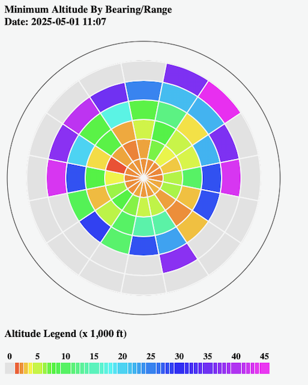

# piaware-tools
PHP Utilities to Analyze PiAware ADS-B Data


## Introduction
These tools were created to analyze aircraft history data produced by
the PiAware ADS-B feeder. This page will describe the installation and operation of the tools.

This is an early stage work in progress. There may be breaking changes in the future but I will do my best to keep those to a minimum.

## System Requirements
These scripts should be able to run on Windows or Linux but my testing was limited to Linux. I have covered the operating system commands for Linux as well as a portion of those for Windows.

## Installation
The first step is retrieving the code from GitHub using Git.
```
git clone git@github.com:diggybell/piaware-tools.git
```
You can place the code anywhere that you want.

The next step is to create a subdirectory under the source code called "data".\

### On Windows
```
cd <your source directory>
md data
```
### On Linux
```
cd <your source directory>
mkdir data
```

The final installation step is setting up web access to the main page. I run my system on Linux and use a symbolic link from the default web tree to my source.
```
sudo ln -s <your source directory> /var/www/html/ads-b
```
You can then access the web page with the URL pattern shown below.
```
http://<hostname>/ads-b/altitude-range.php

or

https://<hostname>/ads-b/altitude-range.php
```

## Operation
These tools can be operated manually or can be integrated into crontab for automated processing.

### Manual Operation
Copy the files from your PiAware feeder to the machine where you are going to do the processing.
```
scp <user>@<hostname>:/run/dump1090-fa/* .
```
Execute the processing script to compile the altitude data.

```
php reader.php --altitude
```

Optionally you can also execute the processign to compile an aircraft history file. There is no graphic processing on this file yet but will be in the future.

```
php reader.php --aircraft
```

### Automatic Operation
The reader.php script can be executed periodically using crontab. You can edit the crontab file to do this
```
crontab -e
```
Add the following line to the file changing the directories where required
```
0,30 * * * * cd <your source directory>; scp <user>@<hostname>:/run/dump1090-fa/* data; php reader.php --altitude
```
This will automatically retrieve the history data from your PiAware feeder every 30 minutes and execute reader.php to update the altitude-stats.json file.

## Administration
There are two options for managing the altitude data based on long term history or daily resets of the data.

### Historical Data Maintenance
There are instances where ADS-B data has invalid alititude information encoded for an aircraft. This will show up on the graph as an altitude in a ring that is way below all the others. To resolve this you will need to edit altitude-stats.json and do the following.
* Search for the altitude and distance in the file
* Zero the altitude and distance
* Save the file
* Execute reader.php
```
php reader.php --altitude
```
If there are multiple invalid entries you can correct them all at once.

Since this utility uses the PiAware history files the invalid altitude will be retained for an hour. I will usually wait an hor before I make the correction.

### Daily Reset of Altitude Data
All that is required to reset the data is to remove altitude-stats.json. This can be done daily using the following entry in crontab to remove the file each night at 23:55.
```
55 23 * * * cd <your source directory>; rm altitude-stats.json
```
If you would like to keep a daily history of the data you can use the following line in crontab
```
55 23 * * * cd <your source directory>; mv altitude-stats.json <your history directory>/altitude-history-`data "+\%Y-\%m-\%d".json
```

## Re-usable Code
There are several code modules that can be re-purposed for other uses.

### cardinals.php
This module contains functions that are useful for working with cardinal directions on a compass.

### icao.php

This module can be used to convert an ICAO Hex code to a US N-number. (US Aircraft Only)

### polar.php
This module contains the base polar diagram functions. It also contains functions for converting between Polar coordinates (GPS) and Cartesian coordinates (display).